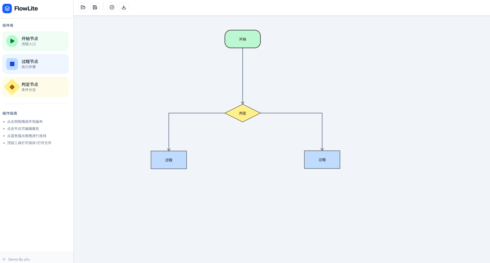
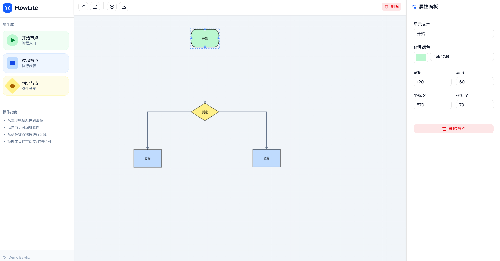
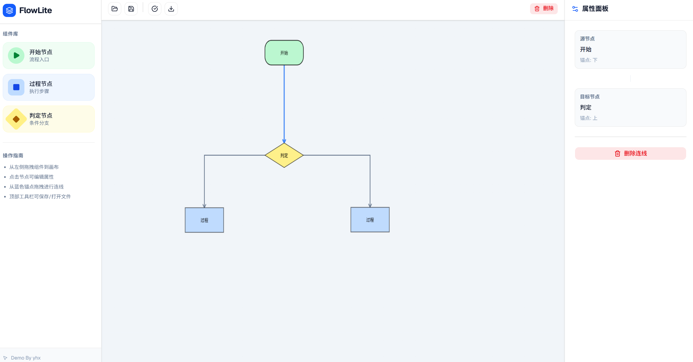
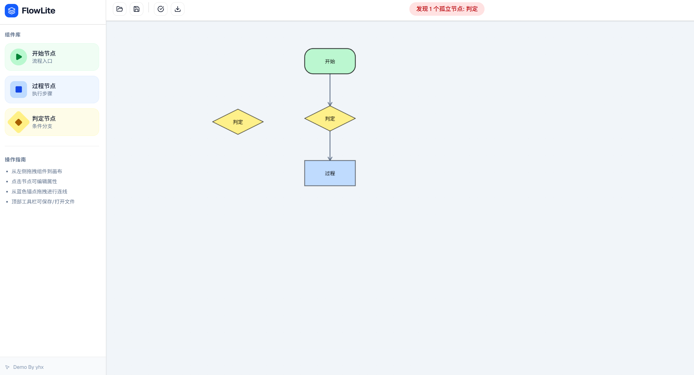

# FlowLite - 轻量级可视化流程建模平台

FlowLite 是一个基于 React 和 HTML5 Canvas 开发的轻量级流程图建模工具。它旨在为用户提供一个直观、流畅的界面，用于创建、编辑和管理流程图，适用于业务流程建模、逻辑结构设计及教学演示。

## 核心功能

- **可视化编辑**：支持通过侧边栏拖拽或点击添加不同类型的流程节点（如：开始、过程、决策、结束）。
- **智能折线连接**：
  - 节点间采用正交折线（Orthogonal Routing）连接，自动保持水平或垂直。
  - **垂直切入**：确保连线在进入节点时始终保持垂直，避免视觉重叠。
  - **可拖拽转折点**：支持手动调整连线的中间段位置，优化布局美观度。
- **交互式操作**：
  - 节点支持自由拖拽移动，连线随动。
  - 选中节点或连线后，右侧属性面板实时显示详细信息。
  - 支持一键删除选中的节点或连线。
- **属性管理**：支持修改节点文本内容，实时预览修改效果。
- **响应式布局**：基于 Tailwind CSS 构建，适配不同尺寸的屏幕空间。
- **导出格式**：支持导出为 json 或 png。
- **导入格式**：支持导入 json 以开始编辑。
- **流程校验**：支持校验流程图是否有断点。

## 简要展示
- **主要工作区**


- **节点信息**


- **连线信息**


- **流程校验**


## 技术栈

- **前端框架**：React 19
- **构建工具**：Vite 6
- **渲染引擎**：原生 HTML5 Canvas (自定义 CanvasEngine)
- **样式处理**：Tailwind CSS 4
- **图标库**：Lucide React

## 环境配置与运行

在开始之前，请确保您的系统中已安装 [Node.js](https://nodejs.org/) (建议版本 18.0+)。

### 1. 安装依赖
在项目根目录下运行以下命令：
```bash
npm install
```

### 2. 启动开发服务器
运行以下命令启动本地预览：
```bash
npm run dev
```
启动后，您可以在浏览器中访问 `http://localhost:3000` 查看项目。

### 3. 项目打包
若需部署到生产环境，运行：
```bash
npm run build
```
打包后的静态文件将生成在 `dist` 目录中。


## 待优化

- **画布缩放与平移**：实现画布缩放（滚轮）和拖拽平移（中键/空格+左键），提升大流程图编辑体验。
- **多选操作**：支持框选（矩形选区）。
- **快捷键支持**：删除（Delete）、复制粘贴（Ctrl+C）、撤销重做（Ctrl+Z）。
- **连线路径算法**：当前折线算法在处理复杂绕障时可能穿过其他节点。

---
